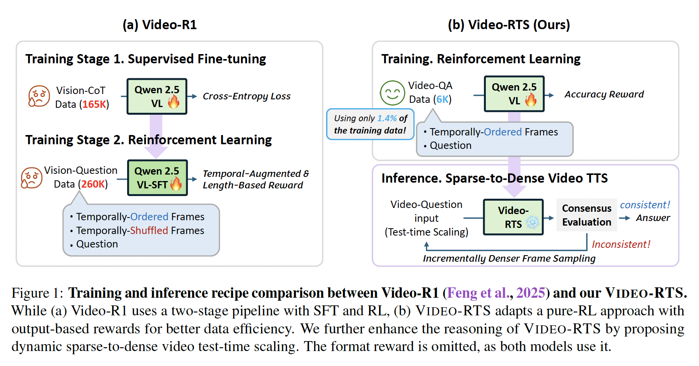
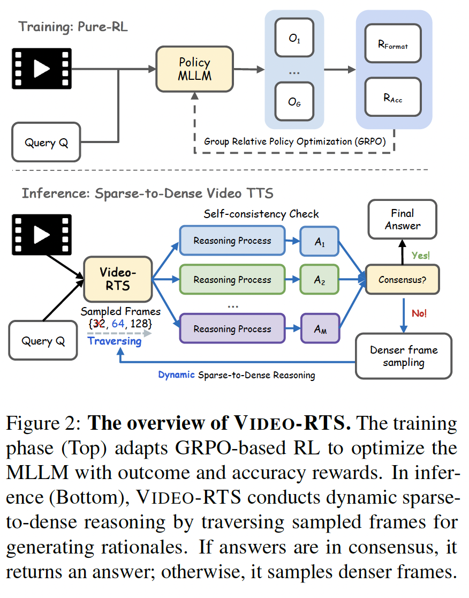

# VIDEO-RTS: Rethinking Reinforcement Learning and Test-Time Scaling for Efficient and Enhanced Video Reasoning

This is the official implementation for Video-RTS, we are still constructing the repo and will soon post the model checkpoint and training pipeline. 

[](https://sites.google.com/cs.unc.edu/videorts2025/)  [](https://arxiv.org/abs/2507.06485)

### Authors: [Ziyang Wang*](https://ziyangw2000.github.io/),  [Jaehong Yoon*](https://jaehong31.github.io/), [Shoubin Yu](https://yui010206.github.io/), [Md Mohaiminul Islam](https://md-mohaiminul.github.io/), [Gedas Bertasius](https://www.gedasbertasius.com/), [Mohit Bansal](https://www.cs.unc.edu/~mbansal/)

### University of North Carolina at Chapel Hill


We introduce Video-RTS, a new approach to improve video reasoning capability with drastically improved data efficiency by combining data-efficient RL with a video-adaptive test-time scaling (TTS) strategy.






## **Installation**

```bash
git clone https://github.com/Ziyang412/Video-RTS.git
cd Video-RTS

# build environment
conda create -n video-rts python=3.11 
conda activate video-rts
bash setup.sh

# qwen video extraction setting, e.g., max frames, resolutions
# Use the [decord] feature to improve speed
cd src/qwen-vl-utils
pip install -e .[decord]
cd ..
```


Following Video-R1, please install the provided version of transformers

```bash
unzip transformers-main.zip
cd ./transformers-main
pip install .
```

## **Download Dataset**
Please refer to the official github of each dataset for video downloading. We provide the annotation file in `./src/r1-v/Evaluation` and please refer to the `./src/r1-v/Evaluation/path_coversion.py` to update the video path. 


## **Inference with S2D Video TTS**

Please update the input model / file name / output file in the given bash file. 

```bash
bash src/video_rts_eval.sh
```


## Acknowledgments
We thank the developers of [Open-R1-Video](https://github.com/Wang-Xiaodong1899/Open-R1-Video), [Video-R1](https://github.com/tulerfeng/Video-R1/tree/main), [Qwen-2.5-VL](https://github.com/QwenLM/Qwen2.5-VL/tree/main) and [TRL](https://github.com/huggingface/trl) for their public code release. 

# Reference
Please cite our paper if you use our models in your works:

```bibtex
@misc{wang2025videortsrethinkingreinforcementlearning,
      title={Video-RTS: Rethinking Reinforcement Learning and Test-Time Scaling for Efficient and Enhanced Video Reasoning}, 
      author={Ziyang Wang and Jaehong Yoon and Shoubin Yu and Md Mohaiminul Islam and Gedas Bertasius and Mohit Bansal},
      year={2025},
      eprint={2507.06485},
      archivePrefix={arXiv},
      primaryClass={cs.CV},
      url={https://arxiv.org/abs/2507.06485}, 
}
